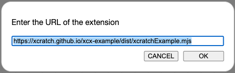

# ambient
Ambient for Scratch.

## How to use
For using this extension, please use [xcratch](https://xcratch.github.io/editor/).

Specify the extension URL as https://610t.github.io/ambient/dist/ambient.mjs .

You can use these blocks:

